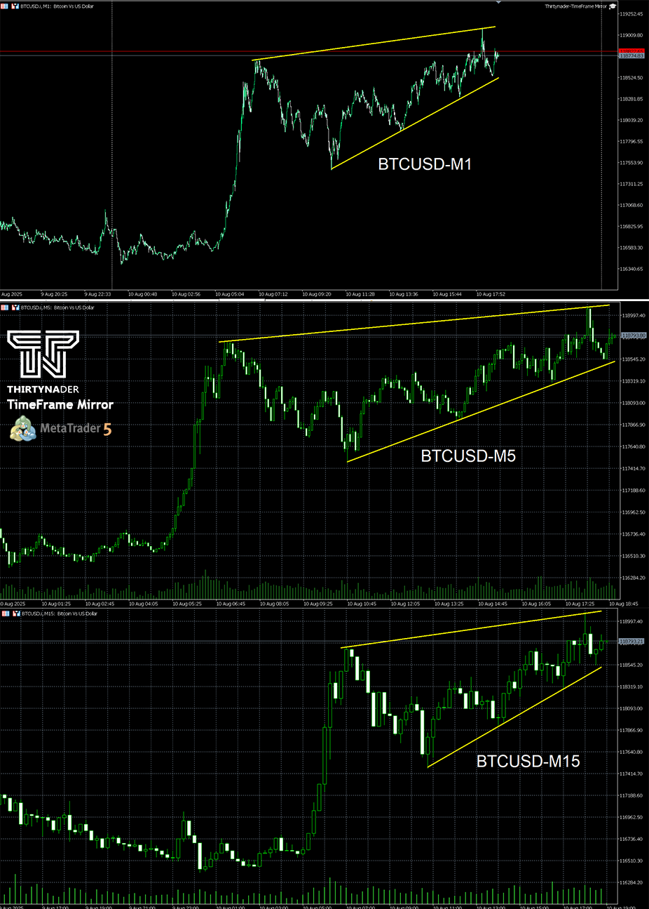
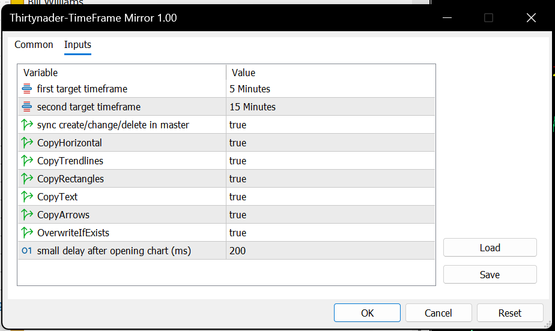

# Thirtynader-TimeFrame Mirror

**TimeFrame Mirror** is a professional Expert Advisor for MetaTrader 5 that allows you to simultaneously view and synchronize objects (such as lines and drawings) from the main timeframe onto two higher timeframes.

This tool is designed for traders who do not have ultra-wide monitors but want to work efficiently with multiple timeframes without constantly switching charts.

---

## Features

- Automatic synchronization of horizontal lines, trendlines, channels, and other drawn objects  
- Simultaneous display on two user-selectable higher timeframes (e.g., 5-min and 15-min)  
- Automatic closing of the opened charts when the EA is removed  
- Easy and customizable input parameters  

---

## Installation and Usage

1. Copy the `Thirtynader-TimeFrame Mirror.ex5` file to your `MQL5/Experts` folder.  
2. Open MetaTrader 5 and drag the Expert Advisor onto your chart with the desired timeframe.  
3. Adjust the input parameters to select your target timeframes and preferences.  
4. Enjoy working efficiently with multiple timeframes synced in real-time!  

---

## Preview

---

## Download

[Download the EX5 file here](https://github.com/Thirtynader/Thirtynader-TimeFrame-Mirror/releases/download/1.0.0/Thirtynader-TimeFrame.Mirror.ex5)

---

## License

This project is licensed under the [Specify your license here, e.g., MIT License].

---

## Contact

For questions or support, contact: your.email@example.com  
Or visit the [GitHub repository](https://github.com/Thirtynader/Thirtynader-TimeFrameMirror)
